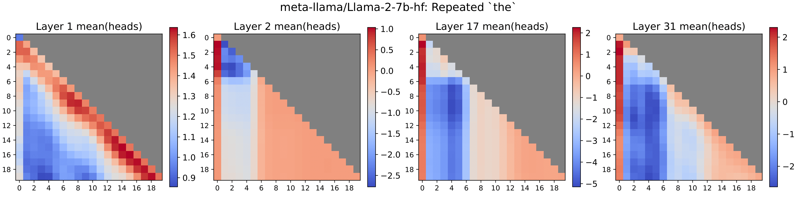

## Interpreting the repeated token phenomenon in LLMs

### [Paper]()

Itay Yona, Ilia Shumailov, Jamie Hayes, Federico Barbero, Yossi Gandelsman

### Abstract
Large Language Models (LLMs), despite their impressive capabilities, often fail to accurately repeat a single word when prompted to, and instead output unrelated text. This unexplained failure mode represents a _vulnerability_, allowing even end-users to diverge models away from their intended behavior. We aim to explain the causes for this phenomenon and link it to the concept of "attention sinks", an emergent LLM behavior crucial for fluency, in which the initial token receives disproportionately high attention scores. Our investigation identifies the neural circuit responsible for attention sinks and shows how long repetitions disrupt this circuit. We extend this finding to other non-repeating sequences that exhibit similar circuit disruptions.  To address this, we propose a targeted patch that effectively resolves the issue without negatively impacting the model's overall performance.  This study provides a mechanistic explanation for an LLM vulnerability, demonstrating how interpretability can diagnose and address issues, and offering insights that pave the way for more secure and reliable models.





### BibTeX

```bibtex
@inproceedings{
      yona2025interpreting,
      title={Interpreting the repeated token phenomenon in LLMs},
      author={Itay Yona and Ilia Shumailov and Jamie Hayes and Federico Barbero and Yossi Gandelsman},
      year={2025}
}
```
